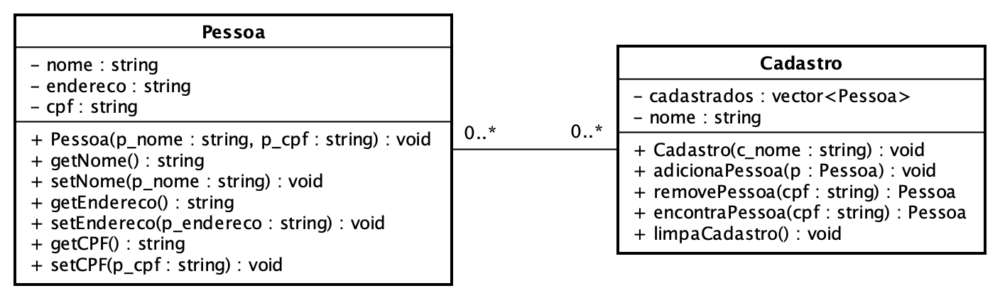

# Cadastros
<sup>Última atualização: 03/05/2022</sup>

## Modelagem
Realize a modelagem de duas classes, *Pessoa* e *Cadastro*. A classe *Pessoa* representa uma pessoa, agregando informações como seu número de CPF, nome e endereço. Por sua vez, a classe *Cadastro* agrega um conjunto de pessoas (objetos da classe *Pessoa*) e um nome para identificá-lo.



Ao invés de guardar cópias de objetos da classe *Pessoa* em objetos que instanciam a classe *Cadastro*, serão armazenadas **referências** na forma de ponteiros. Essa construção é especialmente útil, pois em um cenário com vários cadastros diferentes, se uma mudança ocorre em um objeto da classe *Pessoa* em um cadastro qualquer, essa mudança é refletida em todos os demais cadastros.

Um cuidado ao utilizar esse tipo de estratégia quando da utilização da alocação dinâmica de memória ao adicionar alguma pessoa a algum cadastro. Para que esse comportamento ocorra corretamente, é necessário que, para cada CPF, exista apenas uma instância de objeto da classe *Pessoa*, ou seja, uma vez instanciada uma pessoa para um CPF especifico, não devem ser mais criadas novas instâncias para esse CPF, mas sim buscar por esse objeto e fazer uso de uma referencia para ele.

## Implementação do programa
Usando as classes implementadas, escreva um programa (arquivo `main.cpp`) que cria quatro cadastros, *Cadastro Único*, *Sistema Único de Saúde* (SUS), *Cadastro Estadual* (CE) e *Cadastro Municipal* (CM). O programa deverá inicialmente realizar o cadastro de pessoas no Cadastro Único utilizando os dados estão disponíveis no arquivo de texto [`data/CadastroUnico.txt`](data/CadastroUnico.txt).

Em seguida, o programa deverá receber como entrada um conjunto de pares com números de CPF seguidos pela abreviação do cadastro no qual aquela pessoa deve ser adicionada. Um exemplo dessa entrada seria:

```
234.471.164-39 SUS
234.471.164-39 CE
519.017.593-69 CM
519.017.593-69 CE
389.499.808-35 CE
175.659.343-48 CM
175.659.343-48 SUS
894.019.670-83 CM
```

Após ler e processar a entrada, o programa deve exibir os nomes de todas as pessoas em cada um dos cadastros, exceto no Cadastro Único. Caso haja ninguém cadastrado em um cadastro específico, o programa deverá imprimir `Ninguém Cadastrado` na saída para esse cadastro. Um exemplo de saída para a entrada em questão seria:

```
Sistema único de Saúde
Eliane Sophie Cavalcanti
Ryan Levi Davi Duarte

Cadastro Estadual
Eliane Sophie Cavalcanti
Kamilly Maya Josefa Cardoso
Letícia Liz Rosângela Silva

Cadastro Municipal
Kamilly Maya Josefa Cardoso
Ryan Levi Davi Duarte
Rayssa Andrea da Silva
```

Após a exibição das pessoas em cada cadastro, os objetos criados deverão ser devidamente **destruídos** a fim de possibilitar o programa terminar sem vazamentos de memória. Para destruir os objetos da classe *Pessoa* criados na classe *Cadastro*, deverá ser utilizado o operador `delete` apenas uma vez por pessoa por CPF. Caso isso não seja feito, o programa poderá apresentar falha de segmentação (*segmentation fault*) pelo gerenciamento incorreto de memória.

## Estrutura do projeto
Primando pela modularização, a definição e a implementação das classes deverá ser separada em arquivos cabeçalho (`.h`) e de corpo (`cpp`). **Necessariamente**, os arquivos de cabeçalho deverão estar presentes no diretório `include` e os arquivos de corpo no diretório `src`. O arquivo `main.cpp` correspondente à implementação da função principal do programa deverá **necessariamente** estar também presente no diretório `src`. Dessa forma, os arquivos deste projeto deverão estar organizado de acordo com a seguinte estrutura:

```
+─cadastros              ---> Nome do diretório do projeto
  ├─── CMakeLists.txt    ---> Script de configuração do cmake
  ├─── build             ---> Diretório onde os arquivos executáveis serão gerados
  ├─── data_expected     ---> Diretório que contém os arquivos de saída com as respostas corretas
  ├─── data_in           ---> Diretório que contém os arquivos de entrada para os testes
  ├─── include           ---> Diretório que contém os arquivos cabeçalho (.h)
       └─── cadastro.h   ---> Arquivo cabeçalho referente à definição da classe Cadastro
       └─── pessoa.h     ---> Arquivo cabeçalho referente à definição da classe Pessoa
  └─── src               ---> Diretório que contém os arquivos corpo (.cpp)
       └─── cadastro.cpp ---> Arquivo fonte referente à implementação da classe Cadastro
       └─── main.cpp     ---> Arquivo fonte contendo a implementação da função principal do programa
       └─── pessoa.cpp   ---> Arquivo fonte referente à implementação da classe Pessoa
```

## Execução de testes automatizados
A execução dos testes automatizados para este programa deve ser feita a partir do presente diretório, executando os seguintes comandos:

```
mkdir build
cd build
cmake ..
cmake --build . --target verify
```

Caso haja erro de compilação ou, ao se observar os resultados do testes, identifique-se alguma falha, deve-se corrigir o problema e compilar o projeto novamente conforme descrito anteriormente.

## Conhecimentos necessários
- Entrada/saída padrão
- Leitura de arquivos
- Alocação dinâmica de memória (operadores `new` e `delete`)
- Estruturas condicionais e expressões lógicas
- Passagem de parâmetros por referência
- Classes e objetos
- Visibilidade de membros de classes
- Construtores
- Destrutores
- *Containers* da [*Standard Template Library* (STL)](https://www.cplusplus.com/reference/stl/)
