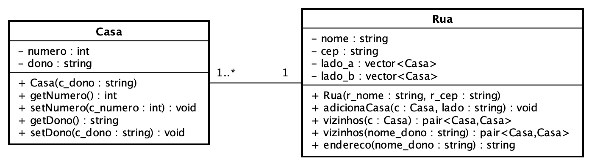

# Casa & Rua
<sup>Última atualização: 09/05/2022</sup>

## Modelagem
Realize a modelagem de duas classes, *Casa* e *Rua*, de acordo com as definições especificadas a seguir.



### Casa
A classe *Casa*, a qual representa uma casa, deve possuir os seguintes membros:

<ins>Atributos:</ins>
Atributos | Descrição
:-------- | :---------
`numero`  | Do tipo inteiro, representa o número da casa
`dono`    | Do tipo [`string`](https://www.cplusplus.com/reference/string/string/), representa o nome do proprietário da casa

<ins>Métodos</ins>
Métodos                        | Descrição
:----------------------------- | :---------
`Casa(string c_dono)`          | Construtor parametrizado para a classe, o qual recebe como parâmetro o nome do proprietário da casa. O número da casa deve ser inicializado com -1.
`int getNumero()`              | Retorna o número da casa
`void setNumero(int c_numero)` | Modifica o número da casa
`string getDono()`             | Retorna o nome do proprietário da casa
`void setDono(string c_dono)`  | Modifica o nome do proprietário da casa

### Rua
A classe *Rua*, a qual representa uma rua que contém um conjunto de casas, deve possuir os seguintes membros:

<ins>Atributos:</ins>
Atributo | Descrição
:------- | :---------
`nome`   | Do tipo [`string`](https://www.cplusplus.com/reference/string/string/), representando o nome da rua
`cep`    | Do tipo [`string`](https://www.cplusplus.com/reference/string/string/), representa o CEP da rua
`lado_a` | Um *container* da [*Standard Template Library* (STL)](https://www.cplusplus.com/reference/stl/) contendo um conjunto de objetos da classe *Casa* que pertencem ao lado A da rua
`lado_b` | Um *container* da [*Standard Template Library* (STL)](https://www.cplusplus.com/reference/stl/) contendo um conjunto de objetos da classe *Casa* que pertencem ao lado B da rua

Observação: escolha o *container* da STL que parecer mais apropriado para servir de atributo à classe *Rua*.

<ins>Métodos</ins>
Método                                   | Descrição
:--------------------------------------- | :---------
`Rua(string r_nome, string r_cep)`       | Construtor parametrizado para a classe, o qual recebe como parâmetros o nome e o CEP da rua
`void adiciona_casa(Casa &c, string lado)`| Adiciona uma casa `c` ao conjunto de casas do lado especificado da rua. O número da casa deve ser modificado de acordo com a posição no respectivo *container*: os números das casas no lado A são sempre pares (começando em 0) e os das casas no lado B são sempre ímpares (começando em 1). Caso o valor do parâmetro `lado` seja diferente de `"A"` ou `"B"` (ou seja, foi informado um lado considerado inválido), nenhuma casa deve ser adicionada a qualquer dos lados da rua.
`pair<Casa, Casa> vizinhos(Casa c)`      | Retorna um [par](https://www.cplusplus.com/reference/utility/pair/) contendo os vizinhos da casa `c`. Uma casa é considerada vizinha se ela vem logo após ou é anterior à casa `c` respectivo *container* da rua em que a casa em questão está adicionada. Se a casa não tiver anterior ou posterior, a casa correspondente deve ter o número igual a -1.
`pair<Casa, Casa> vizinhos(string nome_dono)` | Retorna um [par](https://www.cplusplus.com/reference/utility/pair/) contendo as casas que são vizinhas à pessoa cujo nome é dado por `nome_dono`.
`vector<Casa> casa(string nome_dono)` | Retorna um vetor com todas as casas pertencentes ao dono cujo nome é dado por `nome_dono`.
`string endereco(string nome_dono)` | Retorna o endereço da casa de uma pessoa cujo nome é dado por `nome_dono` no formato `Rua <nome>, <numero_casa>, CEP <CEP>`. Caso a casa não pertença à rua, deve ser retornada uma *string* vazia.

## Implementação do programa
Usando as classes implementadas, escreva um programa (arquivo `main.cpp`) que lê, da entrada padrão, o nome da rua e o CEP, seguido por um conjunto de pares contendo o nome do dono e o lado da rua em que ele mora. Um exemplo de entrada seria:

```
Osvaldo Montenegro
59513-491
Ssanyu Humbert
A
Carina Nekesa
B
Maree Christina
A
João Evangelista
B
Wilhelm Nan
A
```

<ins>Dica:</ins> Note-se que os dados lidos da entrada padrão contêm espaços, logo a leitura de dados utilizando o operador de extração `>>` sobre o objeto `cin` da biblioteca [`iostream`](https://www.cplusplus.com/reference/iostream/) como é tradicionalmente feito implicará que cada palavra separada por espaço seja entendida um dado diferente, o que não estaria correto para este programa. Assim sendo, a leitura correta de dados que contêm espaços deve ser feita utilizando o método `getline` disponibilizada classe [`string`](https://www.cplusplus.com/reference/string/string/getline/) a partir da biblioteca `string`:

```c++
#include <iostream>
using std::cin;

#include <string>
using std::string;

string linha;
getline(cin, linha);
```

Nesse exemplo, será lida a partir da entrada padrão uma linha completa como uma *string* (inclusive com espaços) e armazenada no objeto `linha` do tipo `string`, o qual poderá agora ser manipulado conforme desejado.

O programa deverá então imprimir o endereço de todas as pessoas adicionadas junto com seus vizinhos. Uma saída para o exemplo acima seria:

```
Ssanyu Humbert - Rua Osvaldo Montenegro, 0, CEP 59513-491
Vizinhos
Maree Christina
Carina Nekesa - Rua Osvaldo Montenegro, 1, CEP 59513-491
Vizinhos
João Evangeline
Maree Christina - Rua Osvaldo Montenegro, 2, CEP 59513-491
Vizinhos
Ssanyu Humbert
Wilhelm Nan
João Evangelista - Rua Osvaldo Montenegro, 3, CEP 59513-491
Vizinhos
Carina Nekesa
Wilhelm Nan - Rua Osvaldo Montenegro, 4, CEP 59513-491
Vizinhos
Maree Christina
```

## Estrutura do projeto
Primando pela modularização, a definição e a implementação das classes deverá ser separada em arquivos cabeçalho (`.h`) e de corpo (`cpp`). **Necessariamente**, os arquivos de cabeçalho deverão estar presentes no diretório `include` e os arquivos de corpo no diretório `src`. O arquivo `main.cpp` correspondente à implementação da função principal do programa deverá **necessariamente** estar também presente no diretório `src`. Dessa forma, os arquivos deste projeto deverão estar organizado de acordo com a seguinte estrutura:

```
+─casa_rua            ---> Nome do diretório do projeto
  ├─── CMakeLists.txt ---> Script de configuração do cmake
  ├─── build          ---> Diretório onde os arquivos executáveis serão gerados
  ├─── data_expected  ---> Diretório que contém os arquivos de saída com as respostas corretas
  ├─── data_in        ---> Diretório que contém os arquivos de entrada para os testes
  ├─── img            ---> Diretório com figuras utilizadas na especificação do problema
  ├─── include        ---> Diretório que contém os arquivos cabeçalho (.h)
       └─── casa.h    ---> Arquivo cabeçalho referente à definição da classe Casa
       └─── rua.h     ---> Arquivo cabeçalho referente à definição da classe Rua
  └─── src            ---> Diretório que contém os arquivos corpo (.cpp)
       └─── casa.cpp  ---> Arquivo fonte referente à implementação da classe Casa
       └─── main.cpp  ---> Arquivo fonte contendo a implementação da função principal do programa
       └─── rua.cpp   ---> Arquivo fonte referente à implementação da classe Rua
```

## Execução de testes automatizados
A execução dos testes automatizados para este programa deve ser feita a partir do presente diretório, executando os seguintes comandos:

```
mkdir build
cd build
cmake ..
cmake --build . --target verify
```

Caso haja erro de compilação ou, ao se observar os resultados do testes, identifique-se alguma falha, deve-se corrigir o problema e compilar o projeto novamente conforme descrito anteriormente.

## Conhecimentos necessários
- Entrada/saída padrão
- Laços
- Estruturas condicionais e expressões lógicas
- Passagem de parâmetros por valor e por referência
- Classes e objetos
- Visibilidade de membros de classes
- Construtores
- *Containers* da [*Standard Template Library* (STL)](https://www.cplusplus.com/reference/stl/)
- Classe [`std::pair`](https://www.cplusplus.com/reference/utility/pair/pair/), definida na biblioteca [`utility`](https://www.cplusplus.com/reference/utility/)
